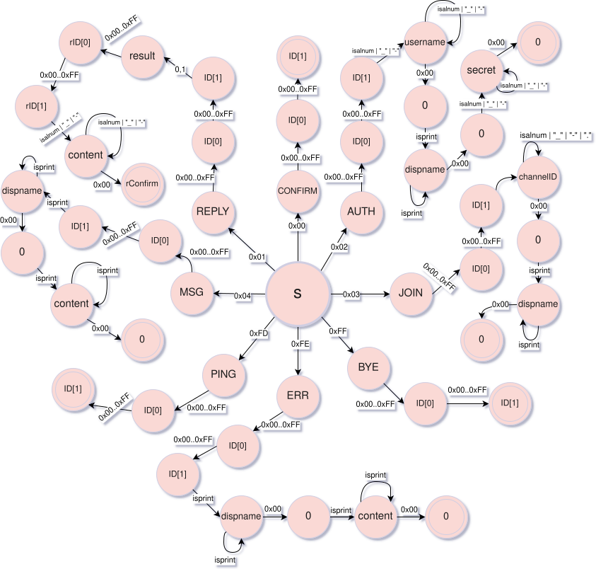
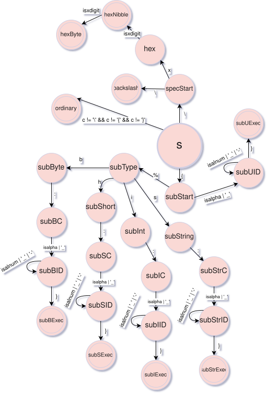
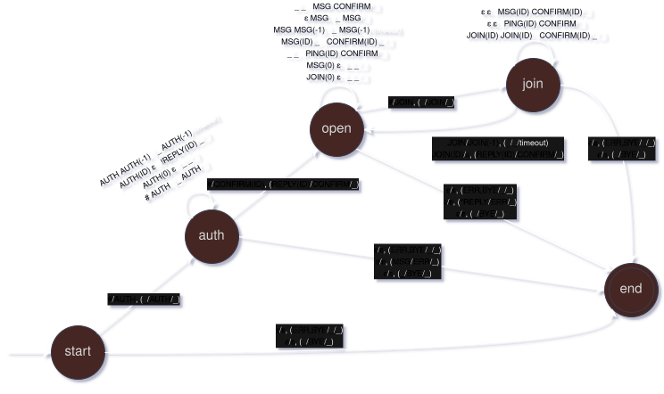
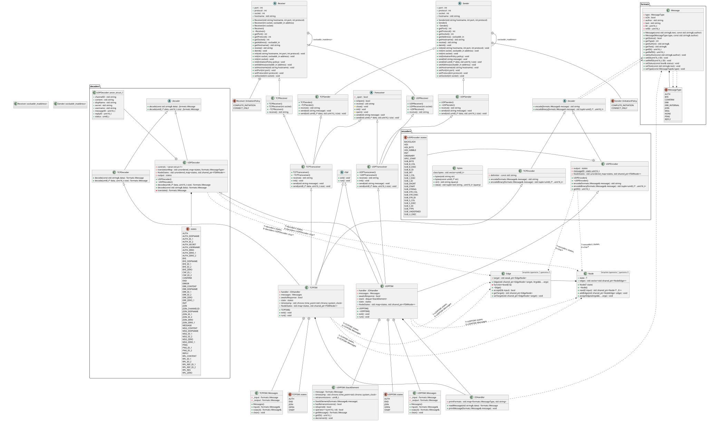
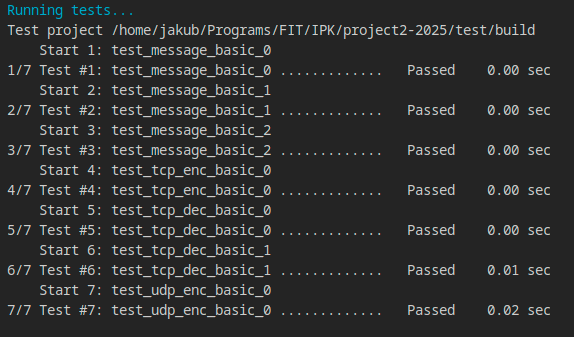
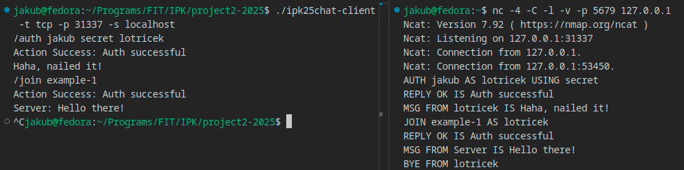
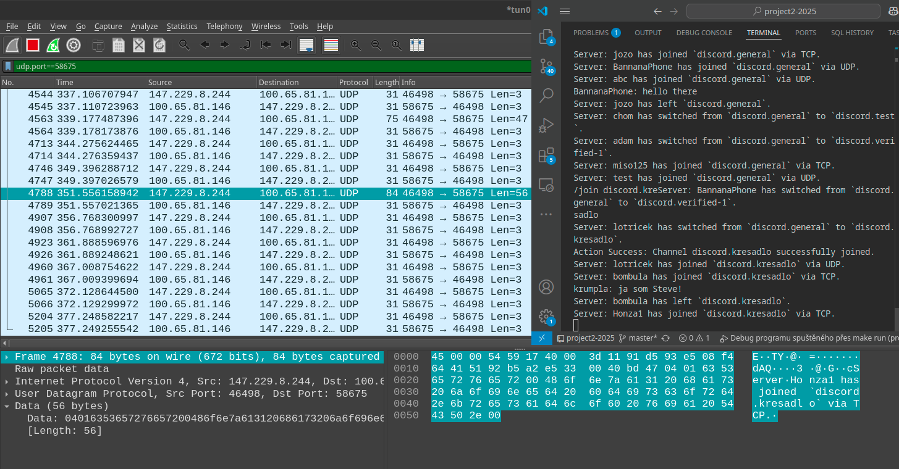

# IPK25 Chat client
### Author: Jakub Ramašeuski (xramas01), 2025
## Table of contents
- [IPK25 Chat client](#ipk25-chat-client)
		- [Author: Jakub Ramašeuski (xramas01), 2025](#author-jakub-ramašeuski-xramas01-2025)
	- [Table of contents](#table-of-contents)
	- [Abstract](#abstract)
	- [Compilation](#compilation)
	- [Usage](#usage)
	- [Theory](#theory)
    	- [Networking](#networking)
        	- [TCP](#tcp)
        	- [UDP](#udp)
    	- [Finite state automata](#finite-state-automata)
  	- [Implementation](#implementation)
		- [Class diagram](#class-diagram)
		- [Dependencies](#dependencies)
	- [Testing](#testing)
	- [Possible issues](#possible-issues)
## Abstract

This is a client for IPK25 chat application used for communication on both TCP and UDP transport layers, written in C++20, but also a testament to an object oriented design.

## Compilation
In a root of this directory, use `make -j${nproc}` or `make` and consequently `make clean` to clean after usage.

## Usage
### when launching
When launching the program, use
`./ipk25chat-client --protocol tcp/udp --hostname HOSTNAME [--port uint16]
[--retransmissions uint8] [--timeout uint16] [--help]`
where:
- `--protocol` is either `tcp` or `udp`
- `--hostname` is the hostname of the server or IP address
- `--port` is the port of the server
- `--retransmissions` is the number of retransmissions (used in UDP)
- `--timeout` is the timeout in seconds (used in UDP)
- `--help` prints help message

### when running
When running the program, consider using `/help` to get help.

## Theory
Just as much is project focused on establishing network connections, it is also focused on utilising finite state automata using oriented graphs.
In this section both networking and will be discussed.
### Networking
Both TCP and UDP are considered networking protocols. While sharing some similarities, they differ in what actions are performed in order to achieve the goal of sending and receiving messages and in what format the messages are sent and received.
#### TCP
In order to send message or communicate through TCP, a connection first must be established. This happens during initiation of TCPSender. After that a messages can be sent until the connection is closed. 
From the application perspective it is assumed that the connection is either properly closed from the server or client side by sending BYE message and in the event of internet outage it is not checked whether the connection is still available.
#### UDP
UDP is a connectionless protocol, meaning that no connection is established and messages are sent directly. However, as for the application perspective, socket is bound to a port during the initiation of UDPReceiver, and consequently UDPTransceiver. Port is then used to send and receive messages. Because of the nature of the internet (made with best effort delivery) and UDP, it is uncertain whether the message arrives or not. Such inconveniences are resolved within application with retransmissions and confirmations sent to server, and ping which is used by the server to check the aliveness of the connection.
### Finite state automata
Due to the absence of regular expressions for non-ascii bytes, finite automata were made to both encode and decode messages.
As for decoder, the automaton is a scanner that extracts data based on transitions (primarily during changing states) and if it halts in non-terminal state it is assumed it encountered a malformed message.

> UDP decoder automaton

Encoding automaton is a matter of passion, as seen in [encoder::udpMessageFormats](src/encoders/UDP_encoder.hpp:75), a primitive formatting language was made for any possible on-the-fly encoding changes.
such language consists of
 - plain characters and
 - special sequences, among which are
   - character representation of hexadecimal digits, which are directly converted to bytes (e.g. `\x0A` directly substitutes for a byte with the value `0x0A`),
   - substitutes (like `{%i:foobar}`), which specify
     - byte width
       - `b` = 1b (char), `h` = 2b (short), `i` = 4b (int) and `s`, which represents a string of unspecified width,
     - name of the variable, as the automaton heavily relies on a data structure (e.g. `std::map<string, value>`) that can provide the variable's value.

> UDP encoder automaton

While UDP finite state automaton preserves same ammount of states as TCP finite state automaton, it is implemented as a "Queue" automaton. and as much as its transition functions rely on input alphabet comprised of Mealy inputs and outputs, it also utilises a queue of messages and a condition that some of these messages within the queue have triggered a timeout.
It is quite uncertain whether it should be called queue or stack, as it does not always target first message in the queue, but it selects the first message that has triggered a retransmission timeout, but the logic is that the messages with lower priority are pushed both to the back and to the front based on their priority.

> UDP finite state automaton
## Implementation
Core of the entire implementation is a class Message, through which all communication comes in and out. Message can be gained either from the IOHandler which cares about user input or from the decoders, or sent to the IOHandler for displaying or any sender.
Based on sent and received messages even a transition within the automaton is triggered. 
Automata are implemented as oriented graph consisted of nodes and edges, in fact, an inspiration was taken from our [Formal launguages](https://github.com/lotricekCZ/ifj24-project/blob/Semantic%2BCodegen/src/scanner/scanner.c) project scanner implementation.

### Class diagram

The project was highly decomposed into smaller functional blocks, meaning that the diagram contains excessive ammount of classes. The reason behind this was testability (e.g. if only decoder is tested, it can work standalone, same can be said for IO handling, sending packets etc.) and also in order to have a different method implementation for TCP and UDP, yet similar interface, option to store classes with the same base, abstract classes like FSM do exist.
I should mention that this diagram was due to the extent of this project generated using [hpp2plantuml](https://github.com/thibaultmarin/hpp2plantuml). After that malformed bindings were commented out and the diagram was further converted to SVG and remodelled using Inkscape. If you want to test it yourself, navigate to `assets/`, run plantuml on the `assets/class_diagram.plantuml` file and then compare the result.
### Dependencies
The code depends on system libraries like `<sys/socket.h>`, `<netinet/in.h>`, `<sys/un.h>` and `<arpa/inet.h>`, C++20 standard library but also [Argumentum](https://github.com/mmahnic/argumentum), which brings Python's argparse-like library to C++, as already stated in [Project 1 - Omega-2025](https://git.fit.vutbr.cz/xramas01/IPK-project-1-omega).

## Testing
Testing was conducted both automatically (especially for encoding) and manually (e.g. with Wireshark, Netcat and IPK discord server).

> example output of testing with `make test` in test/build directory (relies on CMake)

> example output of testing against Netcat

> viewing messages in wireshark (UDP chosen)

> Note: It appears that the [command](https://git.fit.vutbr.cz/NESFIT/IPK-Projects/src/branch/master/Project_2/README.md#tcp-communication) suggested by the project description, `nc -4 -c -l -v 127.0.0.1 4567` does not work. It launches, but in order not to crash it needed to be modified as `nc -4 -C -l -v -p 4567 127.0.0.1` with capital C.

## Possible issues
I was unable to run the suggested virtual machine and nix environment provided by the project description, at this moment it is uncertain whether [std::erase_if](https://en.cppreference.com/w/cpp/container/vector/erase2) from C++20 is really available in the compiler on the test machine or not.